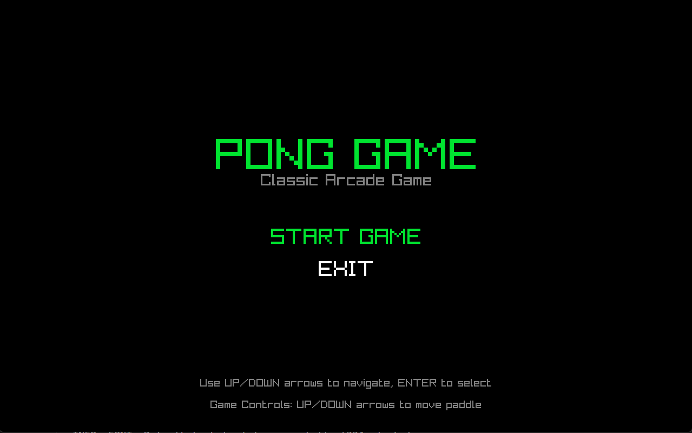
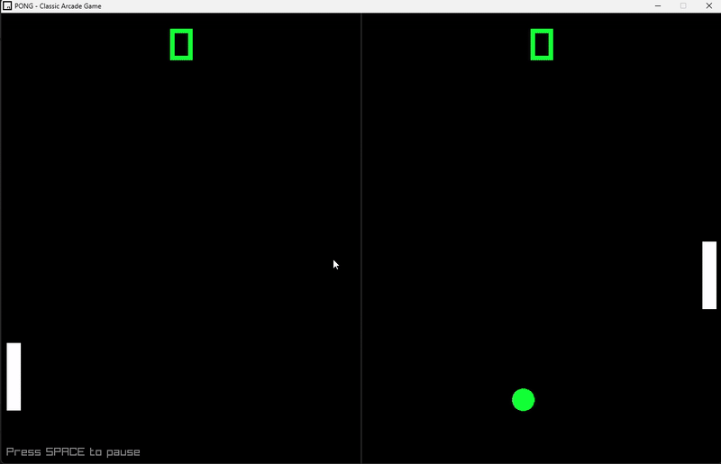
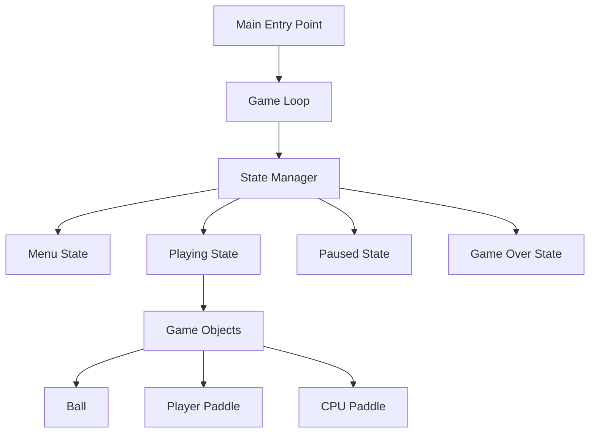

# 🏓 Pong Game - C++ OOP & Design Patterns


> A modern implementation of the classic Pong game demonstrating **Object-Oriented Programming** principles and **Design Patterns** in C++

<div align="center">
  
</div>

---

## 📖 **About This Project**

This Pong game serves as a comprehensive demonstration of **advanced C++ programming concepts**, showcasing how classic game development principles can be implemented using modern object-oriented design patterns. The project emphasizes clean architecture, maintainable code, and professional development practices.

---

## 🎮 **Live Gameplay Demo**

<div align="center">
  
  <p><em>Watch the game in action - showcasing real-time gameplay, AI behavior, and smooth performance</em></p>
</div>

---

## ✨ **Key Features**

| Feature | Description |
|---------|-------------|
| 🎯 **Classic Gameplay** | Authentic Pong mechanics with modern enhancements |
| 🤖 **AI Opponent** | Intelligent CPU player with adjustable difficulty |
| 🎨 **State Management** | Clean menu system (Start, Playing, Paused, Game Over) |
| ⚡ **Performance** | Smooth 60 FPS gameplay with optimized rendering |
| 🏗️ **Clean Architecture** | Professional C++ code following best practices |

---

## 🏗️ **Project Architecture**

### **File Structure**
```
Game/
├── 📄 main.cpp          # Entry point & game initialization
├── 📄 game.cpp          # Core game logic & class implementations
├── ⚙️ Makefile          # Build configuration & dependencies
├── 🎮 main              # Compiled executable
├── 📁 assets/           # Game assets (images, demos)
├── 📚 README.md         # Project documentation
└── 🔧 *.dll             # Windows runtime libraries
```

### **System Overview**


---

### **OOP Principles Demonstrated**

| Principle | Implementation | Example |
|-----------|---------------|---------|
| **🔒 Encapsulation** | Private data with public interfaces | `Ball` class hides internal physics |
| **🧬 Inheritance** | `CPUPaddle` extends `Paddle` | Code reuse and specialization |
| **🎭 Polymorphism** | Virtual functions with overrides | Different `update()` behaviors |
| **🎨 Abstraction** | `GameObject` abstract base class | Common interface for all entities |

---
## 🚀 **Getting Started**

### **Prerequisites**
- **C++ Compiler**: GCC 7.0+, Clang 5.0+, or MSVC 2017+
- **Raylib**: Graphics library for rendering
- **Make**: Build automation tool

### **Installation & Build**

```bash
# 1. Clone the repository
git clone https://github.com/yourusername/pong-game.git
cd pong-game/Game

# 2. Build the project
make

# 3. Run the game
./main
```

### **Alternative Build (Manual)**
```bash
g++ -o main main.cpp game.cpp -lraylib -lGL -lm -lpthread -ldl -lrt -lX11
```

### **Game Controls**

| Action | Key | Description |
|--------|-----|-------------|
| **Navigate Menu** | ↑↓ Arrow Keys | Move through menu options |
| **Select Option** | Enter | Confirm menu selection |
| **Move Paddle** | ↑↓ Arrow Keys | Control player paddle |
| **Pause/Resume** | Space | Toggle game pause |
| **Return to Menu** | Space | From game over screen |

---

## 🔮 **Future Enhancements**

### **Planned Features**
- [ ] **Sound System**: Audio feedback and background music
- [ ] **Particle Effects**: Visual enhancements for collisions
- [ ] **Multiple Difficulty Levels**: Configurable AI behavior
- [ ] **Tournament Mode**: Multiple rounds and advanced scoring
- [ ] **Network Multiplayer**: Online gameplay capability

### **Technical Improvements**
- [ ] **Component System**: ECS architecture for better modularity
- [ ] **Resource Manager**: Centralized asset loading and caching
- [ ] **Configuration System**: External settings file support
- [ ] **Performance Profiler**: Built-in performance monitoring

## 🙏 **Acknowledgments**

- **Raylib Community**: Excellent graphics library and documentation
- **Modern C++ Guidelines**: Best practices and coding standards
- **Game Programming Patterns**: Design pattern inspiration
- **Open Source Community**: Continuous learning and collaboration

---

<div align="center">

**⭐ Star this repository if you found it helpful!**

**🍴 Fork to explore and learn from the code**

**💬 Open an issue for questions or suggestions**

---


</div>
